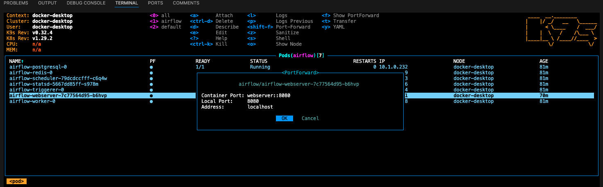
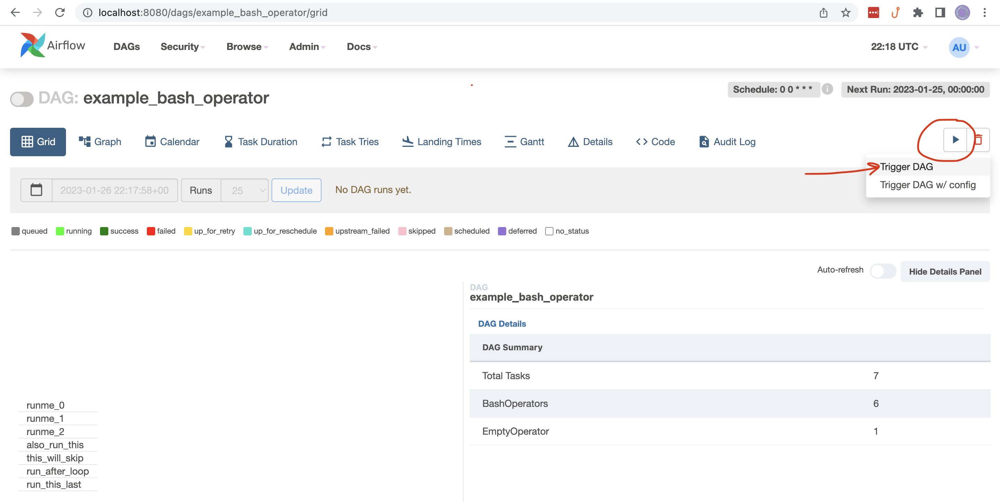
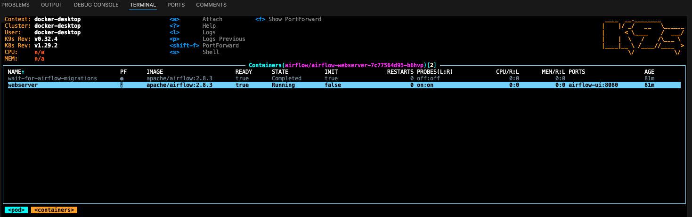
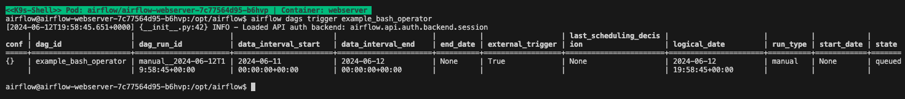

# Run Airflow 2 Locally

According to the official [Airflow Installation](https://airflow.apache.org/docs/apache-airflow/stable/installation/index.html#) docs, there are several ways to install Airflow 2 locally. To encourage standardization of local environments at Avant, we offer our own instructions for installing Airflow. 

## Prerequisites
### Install required packages via homebrew
```bash
brew install helm
brew install derailed/k9s/k9s
```

### Install Docker Desktop

Install [Docker Desktop](https://www.docker.com/products/docker-desktop/), and use your Avant email to create a Docker account. 

### Clone the `airflow-local` repository

```bash
git clone https://github.com/dylan-turnbull/airflow-local.git
```

# Basic setup
This setup enables to you to point Airflow to any local directory containing DAG files: the DAGs needn't be in this repository in order for you to run them. We'll copy example DAGs from this repo to a new location to demonstrate this.

## Copy sample DAGs to relevant directory

```bash
export DAGS_DIR="Documents/airflow-dags"
mkdir ~/${DAGS_DIR}
cp -r airflow-local/example-dags/* ~/${DAGS_DIR}
```

## Kubernetes
Airflow will be run in kubernetes via helm. We'll set it up in a namespace called `airflow` per the instructions that follow.

### Configure k8s context
Enable kubernetes in your docker settings. This will configure your local kubernetes environment to run in the `docker-desktop` context. You can alternatively run via [minikube](https://minikube.sigs.k8s.io/docs/start/?arch=%2Fmacos%2Fx86-64%2Fstable%2Fbinary+download) if preferred.


Restart docker desktop.

### Add airflow repo via helm
```bash
helm repo add apache-airflow https://airflow.apache.org/
helm repo update
```

### Create persistent volume & persistent volume claim
Kubernetes will access our local DAG files through a persistent volume and persistent volume claim. This is similar to volume mounting local directories to a container when using `docker-compose`.

#### Update persistent volume path
Update the value of `spec.hostPath.path` in `airflow-volume.yml` to the directory that you copied the example DAGs to in the preceeding section. Note that the full path is required, e.g. `"/Users/<user>/Documents/airflow-dags"` and not `"~/Documents/airflow-dags"`.

#### Create the PV and PVC
```bash
kubectl apply -f airflow-local/airflow-volume.yml --namespace airflow
```

### Start airflow
```bash
helm install airflow apache-airflow/airflow --namespace airflow -f values.yml
```

You should now have an installed Airflow chart (with release name "airflow" and namespace "airflow"). Confirm this by running `helm list --namespace airflow`. 

```bash
NAME     NAMESPACE  STATUS    CHART           APP VERSION
airflow  airflow    deployed  airflow-1.13.1  2.8.3 
```

Now open a new terminal and run `k9s --namespace airflow`. All pods should be running.


## Using Airflow
### Port forward
You need to make the Airflow webserver accessible to your local machine:

1. Arrow down in `k9s` to the `webserver` pod
2. Type `<shift>` + `<f>`
3. Select `OK`



### Open the Airflow UI
In your web browser, go to [http://localhost:8080/home](http://localhost:8080/home). Log into Airflow with username `admin` and password `admin`.

### Run DAGs
#### Trigger a DAG from the UI

1. Click on DAG in the home page
2. Click "play" button in the DAGs page



#### Trigger a DAG from the command line
1. In `k9s`, access the shell of the `webserver` container using `<s>`
    

2. Run `airflow dags trigger <dag_id>`
    

3. Type `exit` in the shell to return to `k9s`

### Making changes to a DAG
Restart the webserver pod when you make a change to a DAG file. Do this in `k9s` with `<ctrl> + <d>` with the pod selected. The existing pod will terminate and the new pod will reflect your DAG changes. You'll need to port-forward the webserver again if interacting with the UI.

### k9s operators
* Drill down through pods, containers, and logs with `<return>`
* Go back up a level with `<esc>`
* Enter a container's shell with `<s>`
* Delete elements with `<ctrl> + <d>`
* General navigation with `<shift> + <;>`
    * `pod`
    * `namespace`
    * `persistentvolume`
    * `pvc`

# Advanced setup
Complete the basic setup prior to proceeding through this section.

## Create a custom docker image
Follow these steps to extend the base Airflow image as desired, e.g. to add a databricks provider.

1. Create a copy of the Dockerfile in this repo
    ```bash
    cp airflow-local/Dockerfile ~/${DAGS_DIR}/Dockerfile
    ```

2. Edit the new dockerfile like so
    ```
    FROM apache/airflow
    COPY . /opt/airflow/dags
    RUN pip install --no-cache-dir apache-airflow-providers-databricks
    ```

3. Build the image
    ```bash
    docker build --pull --tag my-image:0.0.1 ~/${DAGS_DIR}
    ```

## Start Airflow using the custom image
```
helm install airflow apache-airflow/airflow \
    --namespace airflow \
    -f airflow-local/values.yml \
    --set images.airflow.repository=my-image \
    --set images.airflow.tag=0.0.1 \
    --wait=false
```

ref: https://github.com/airflow-helm/charts/tree/main/charts/airflow#frequently-asked-questions
