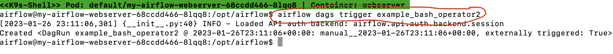

# Run Airflow 2 Locally

According to the official [Airflow Installation](https://airflow.apache.org/docs/apache-airflow/stable/installation/index.html#) docs, there are several ways to install Airflow 2 locally. To encourage standardization of local environments at Avant, we offer our own instructions for installing Airflow. 

## Prerequisites
### Install required packages via homebrew
```bash
brew install helm
brew install derailed/k9s/k9s
```

### Install Docker Desktop

Install [Docker Desktop](https://www.docker.com/products/docker-desktop/), and use your Avant email to create a Docker account. 

### Clone the `airflow-local` repository

```bash
git clone https://github.com/dylan-turnbull/airflow-local.git
```

# Basic setup
This setup enables to you to point Airflow to any local directory containing DAG files: the DAGs needn't be in this repository in order for you to run them. We'll copy example DAGs from this repo to a new location to demonstrate this.

## Copy sample DAGs to relevant directory

```bash
export DAGS_DIR="Documents/airflow-dags"
mkdir ~/${DAGS_DIR}
cp -r airflow-local/example-dags/* ~/${DAGS_DIR}
```

## Kubernetes
Airflow will be run in kubernetes via helm. We'll set it up in a namespace called `airflow` per the instructions that follow.

### Configure k8s context
Enable kubernetes in your docker settings. This will configure your local kubernetes environment to run in the `docker-desktop` context. You can alternatively run via [minikube](https://minikube.sigs.k8s.io/docs/start/?arch=%2Fmacos%2Fx86-64%2Fstable%2Fbinary+download) if preferred.


Restart docker desktop.

### Add airflow repo via helm
```bash
helm repo add apache-airflow https://airflow.apache.org/
helm repo update
```

### Create persistent volume & persistent volume claim
Kubernetes will access our local DAG files through a persistent volume and persistent volume claim. This is similar to volume mounting local directories to a container when using `docker-compose`.

#### Update persistent volume path
Update the value of `spec.hostPath.path` in `airflow-volume.yml` to the directory that you copied the example DAGs to in the preceeding section. Note that the full path is required, e.g. `"/Users/<user>/Documents/airflow-dags"` and not `"~/Documents/airflow-dags"`.

#### Create the PV and PVC
```bash
kubectl apply -f airflow-local/airflow-volume.yml --namespace airflow
```

### Start airflow
```bash
helm install airflow apache-airflow/airflow --namespace airflow -f values.yml
```

You should now have an installed Airflow chart (with release name "airflow" and namespace "airflow"). Confirm this by running `helm list --namespace airflow`. 

```bash
NAME     NAMESPACE  STATUS    CHART           APP VERSION
airflow  airflow    deployed  airflow-1.13.1  2.8.3 
```

Now open a new terminal and run `k9s --namespace airflow`. All pods should be running.


## Ok Now What?

### Open a new terminal and run `k9s`

```bash
k9s
```

**NOTE**: You can switch between the kubernetes and celery executors by updating the `values.yml` file.

### "Port-Forward" `my-airflow-webserver`

* Scroll down to `my-airflow-webserver` service
* Type `<shift>` + `<f>`
* Select `OK`


### Open the Airflow UI

* In your web browser, go to [http://localhost:8080/home](http://localhost:8080/home) 
* Log into Airflow with username "admin" and password "admin"

### Do stuff

**Select an existing DAG and trigger it from the UI**

* Click on DAG in the home page
* Click "play" button in the DAGs page


**Create a new DAG and trigger it from the command line**

* Create new python script (**REMEMBER**: DAG files are stored in `~/Documents/airflow-dags`)
* In `k9s`, select `my-airflow-webserver` service (using `<return>`)
* Access the shell of the running pod (using `<s>`)
* Run ```airflow dags trigger <new_dag_id>```




**NOTE**: You can exit out of the `k9s` shell by running the `exit` command, and you can "back out" of `k9s` filters by using `<esc>`.

## Install Airflow 2 (advanced)

If you want to install extra dependencies (e.g. a provider package) as part of your Airflow deployment you can do so in a custom Docker image.

### Update Dockerfile with relevant dependencies

```
FROM apache/airflow
COPY . /opt/airflow/dags
RUN pip install --no-cache-dir apache-airflow-providers-databricks
```

### Copy sample DAGs and Dockerfile to relevant directory

```bash
export DAGS_DIR="Documents/airflow-dags"
mkdir ~/${DAGS_DIR}
cp -r airflow-local/example-dags/* ~/${DAGS_DIR}
cp airflow-local/Dockerfile ~/${DAGS_DIR}/Dockerfile
```

### Complete Airflow installation

```bash
docker build --pull --tag my-image:0.0.1 ~/${DAGS_DIR}
helm repo add apache-airflow https://airflow.apache.org/
helm repo update
kubectl apply -f airflow-local/airflow-volume.yml
helm install airflow apache-airflow/airflow \
    --namespace default \
    --version 1.6.0 -f airflow-local/values.yml \
    --set images.airflow.repository=my-image \
    --set images.airflow.tag=0.0.1 \
    --wait=false
```

**ref**: https://github.com/airflow-helm/charts/tree/main/charts/airflow#frequently-asked-questions

